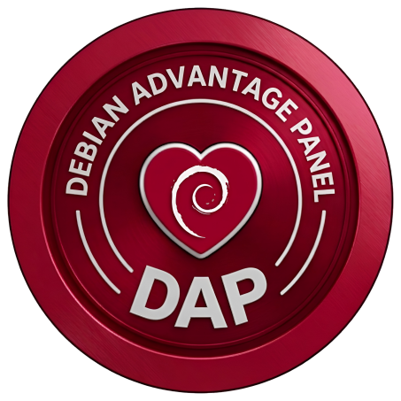

#  Debian Advantage Panel (DAP)

**🌐 Idioma:** Português (BR) | [English](README.en.md) | [Español](README.es.md)


> Deixando o seu Debian pronto para o uso diário — visual, rápido e sem terminal.

## 🚀 Instalação

```bash
bash <(curl -s https://raw.githubusercontent.com/vitaotub/Debian-Advantage-Panel/main/install.sh)
```

**Comandos disponíveis após instalar:**

```bash
dap                       # Iniciar (modo normal)
dap-compat                # Iniciar (modo compatibilidade — GPUs antigas)
./install.sh --update     # Atualizar
./install.sh --uninstall  # Desinstalar
```

## 📖 O que é

Painel de automação visual para **Debian Stable**. Transforma uma instalação feita a partir de **Live ISO** em um sistema completo — codecs, drivers, repositórios, localização, corretor ortográfico, ferramentas — através de cliques, sem abrir o terminal.

**Por que Live ISO?** As Live ISOs do Debian trazem pacotes incompletos por padrão: localização não gerada, corretor ortográfico ausente, codecs básicos faltando, firmware incompleto, Flatpak não instalado. O DAP existe para fechar essa lacuna com um clique.

**Um único ponto de entrada**: o botão **"Iniciar"** leva você pelas sessões passo a passo. Cada botão lembra seu próprio estado. Fechar e reabrir o DAP mostra exatamente onde você parou.

**Projeto irmão do [Fedora Advantage Panel](https://github.com/vitaotub/Fedora-Advantage-Panel)** — compartilha filosofia, padrões visuais e arquitetura, mas o conteúdo é específico para o Debian.

## ⚠️ Status atual — v0.1-10082026

**Esta é uma versão em desenvolvimento ativo, com todas as sessões do escopo implementadas.**

### O que já funciona

- ✅ Landing page com relógio, botão "Iniciar" e rodapé
- ✅ Container WebKitGTK nativo (janela própria, sem navegador externo)
- ✅ Servidor Node.js local (127.0.0.1:3000)
- ✅ Internacionalização PT-BR / EN / ES com troca em tempo real
- ✅ Tema claro/escuro com persistência em `localStorage`
- ✅ Sistema de progresso (`.progresso.json`)
- ✅ Autenticação gráfica (kdesu / pkexec / sudo -A)
- ✅ Log Matrix verde em tempo real (SSE)
- ✅ Sistema de fila de Flatpak
- ✅ Bloqueio de sessão durante execução
- ✅ Detecção de hardware em tempo real (endpoint `/hardware-scan`)
- ✅ Instalação, atualização e desinstalação via `install.sh`

### Sessões implementadas

**13 sessões de automação:**

1. 🚀 Primeiros Passos
2. 📦 Aplicativos Recomendados
3. 🔤 Codecs e Compatibilidade
4. 🖥️ Hardware
5. 🔌 Dispositivos e Periféricos
6. 🎮 Gaming
7. 🏠 Casa e Escritório
8. 📊 Diagnóstico
9. 🎬 Produção Multimídia
10. 💻 Virtualização
11. 🛠️ Ajustes e Manutenção
12. 🐧 Estado do Debian
13. 📖 Sobre o DAP

**O `guiado.html` está funcional** — navegação entre sessões, sistema de progresso, i18n, tema claro/escuro, fila de Flatpak, autenticação gráfica, detecção de hardware.

## 🎨 Destaques

- **Interface clara** com acento vermelho Debian (`#a80030`), alternável para tema escuro
- **Multilíngue** (PT-BR, EN, ES) com troca em tempo real
- **Logs em tempo real** via SSE, com buffer de replay
- **Lixeira unificada** para Flatpaks e apps não-Flatpak
- **Botão "Abrir"** em todos os apps GUI — abre em sessão própria (sobrevive ao fechar o DAP)
- **Fila de instalação** de Flatpaks — clique em vários em sequência
- **Bloqueio inteligente** — evita conflitos de lock no `dpkg` e bloqueia navegação entre sessões durante execução
- **Autenticação gráfica robusta** — cadeia `kdesu → pkexec → sudo -A` cobre todos os DEs do Debian
- **Container WebKitGTK nativo** (sem navegador externo)
- **Detecção de hardware em tempo real** — cada sessão de Hardware e Dispositivos verifica o driver em uso
- **CoolerControl via repositório oficial** (não está no main do Debian)
- **AppArmor no painel de Estado do Debian** (substitui o SELinux do Fedora)

## 🖥️ Desktops suportados

GNOME, KDE Plasma, XFCE, Cinnamon, MATE, LXQt, LXDE, Budgie, Sway, Hyprland, i3 e outros tiling WMs.

## 📋 Requisitos

- **Debian 13 (Trixie) ou mais novo** — Stable
- **Não** roda em derivados (MX, LMDE, Kali, Raspberry Pi OS) — pode funcionar, mas não há suporte
- **Não** roda em Testing/Sid — pode funcionar, mas não há suporte
- Instalação feita a partir de **Live ISO** (não netinst, não DVD) — para aproveitar ao máximo as sessões de "Primeiros Passos"

## 📄 Licença

**GPL-3.0** — veja [LICENSE](LICENSE).

## 👤 Autor

**VitãoTub** — [vitaotub.com](https://www.vitaotub.com) · [github.com/vitaotub](https://github.com/vitaotub)

## 🙏 Agradecimentos

[](https://www.debian.org/)
[](https://www.deepseek.com/)

**Feito com ❤️ para a comunidade Debian**
